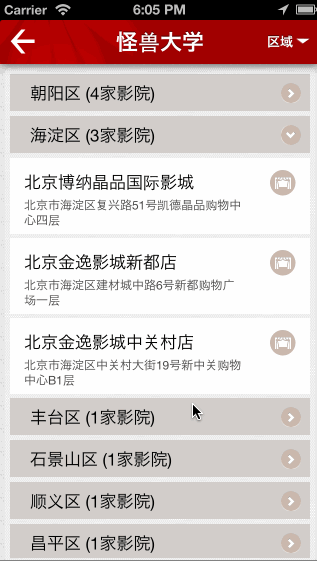
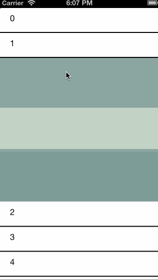

TQMultistageTableView
=====================

## Overview

**TQMultistageTableView**是一个分3层的列表控件，第一层点击后，可展开第二层列表，第二层点击可展开第三层视图。层之间展开和关闭是互斥的，同时只有一个展开的列表层级。支持最低IOS版本为 **IOS6.0** 。

## Demo

左边的 **gif** 图片是真实项目中通过这个控件实现的功能。

右边的 **gif** 图片是这个项目中的Demo。

____
 

## Usage

这个控件的使用与UITableView基本类似。

####  About TinyQ

email : <tinyqf@gmail.com>
 
blogs : <http://tinyq.me>

